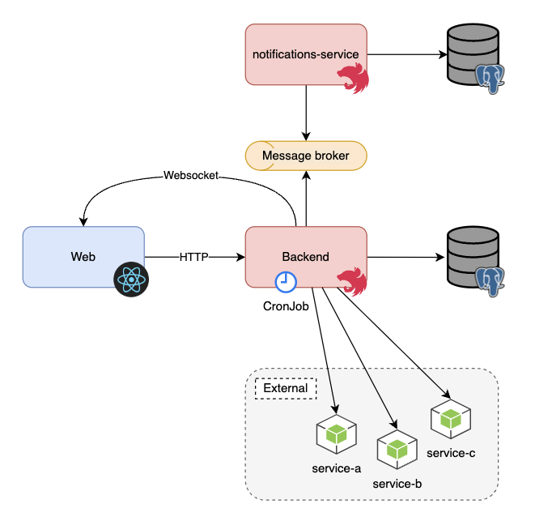

# API Health Monitoring

This app monitors registered APIs health

- [Technologies](#technologies)
  - [Frontend](#frontend)
  - [Backend](#backend)
- [Setup](#setup)
- [Architecture diagram](#architecture-diagram)

## Technologies

### Frontend

- Vitejs
- React
- TypeScript
- TailwindCSS

### Backend

- Node.js
- NestJS
- TypeScript
- TypeORM

## Setup

1. Install the dependencies

```bash
npm install
```

2. Run the application

```bash
npm run dev
```

## Architecture Diagram



## Backlog

See the mapped backlog for new features and fixes.
[Backlog](https://github.com/buemura/api-monitoring/docs/backlog.md)
